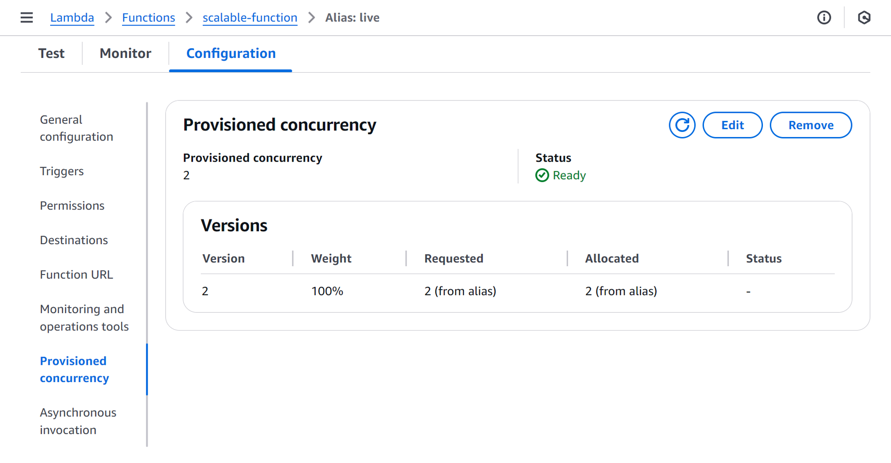

# cdk-aws-lambda-dynamic-provisioned-concurrency

CDK app that deploys a Lambda function with dynamic provisioned concurrency and scales it based on the provisioned concurrency utilization.

## Prerequisites

- **_AWS:_**
  - Must have authenticated with [Default Credentials](https://docs.aws.amazon.com/cdk/v2/guide/cli.html#cli_auth) in your local environment.
  - Must have completed the [CDK bootstrapping](https://docs.aws.amazon.com/cdk/v2/guide/bootstrapping.html) for the target AWS environment.
- **_Node.js + npm:_**
  - Must be [installed](https://docs.npmjs.com/downloading-and-installing-node-js-and-npm) in your system.

## Installation

```sh
npx projen install
```

## Deployment

```sh
npx projen deploy
```

## Usage

1. Grab the `<LAMBDA_FUNCTION_URL>` from the deployment outputs:

   ```sh
   Outputs:
   cdk-aws-lambda-dpc-basic-dev.ScalableFunctionAliasUrl = <LAMBDA_FUNCTION_URL>
   ```

2. [Install oha](https://github.com/hatoo/oha?tab=readme-ov-file#installation), a HTTP load testing tool, and put your Lambda function under stress:

   ```sh
   oha -q 10 -z 1m <LAMBDA_FUNCTION_URL>
   ```

3. In AWS Console, `Lambda` ➜ `scalable-function` ➜ `Aliases` ➜ `live`:

   

4. Keep monitoring the `Provisioned concurrency` tab of the Lambda function alias. After around three minutes, you should see it scaling up from 1 to 2 or more as a result of the load increase.

## Cleanup

```sh
npx projen destroy
```

## Architecture Diagram


